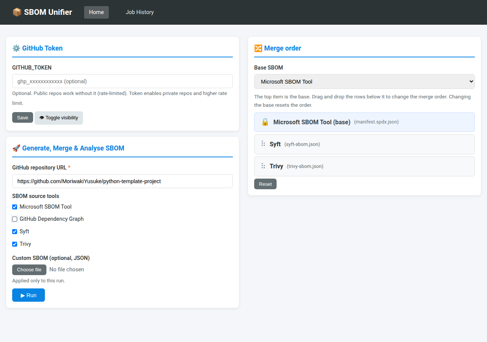
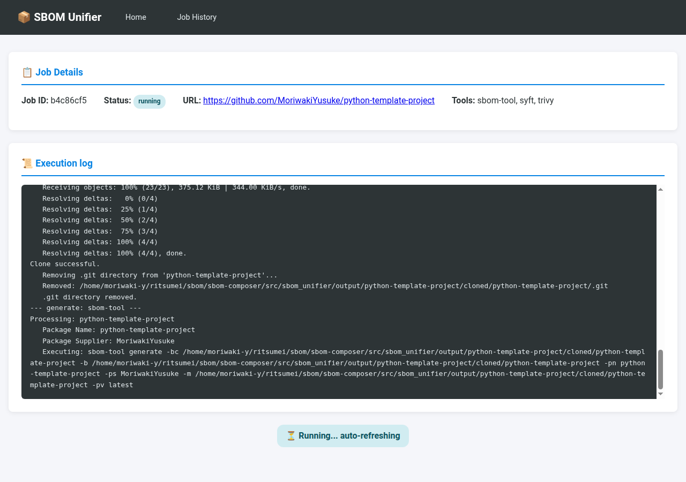
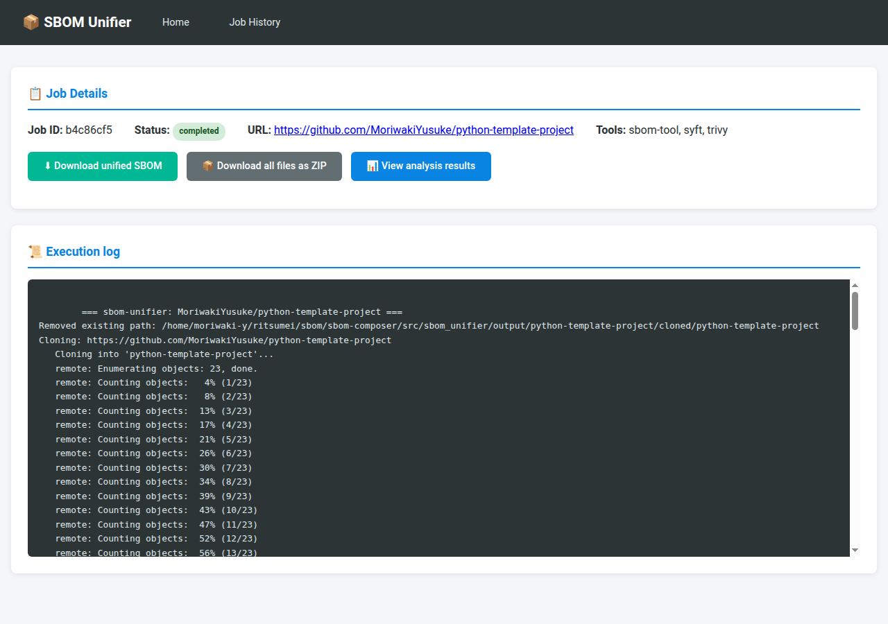

# Usage — Web UI walkthrough

This walks through a full run in the Web UI: from a GitHub URL to a downloadable
unified SPDX SBOM. It assumes the server is already running (see
[Quick start](../README.md#quick-start)) and reachable at <http://127.0.0.1:5000>.

## 1. Configure the run

The home page is the run form.

- **GitHub repository URL** (required) — `https://github.com/<owner>/<repo>`.
- **GitHub Token** (optional) — public repositories work without it (rate-limited).
  A read-scoped token enables private repositories and raises the rate limit.
  Saving stores it in `.env` (not persisted in Docker — see
  [architecture.md](architecture.md#persistence-boundaries)).
- **SBOM source tools** — which generators to run. All are selected by default;
  the screenshot above runs `sbom-tool`, `syft`, and `trivy`.
- **Merge order** — the top (locked 🔒) row is the **base** SBOM; every other
  tool is merged into it, top to bottom. Change the base from the dropdown, and
  drag the rows below it to reorder. The default base is the Microsoft sbom-tool.
- **Custom SBOM** (optional) — upload a JSON SBOM to merge in alongside the
  generated ones.

Press **▶ Run**.

## 2. Watch it run

You are redirected to the job page, which streams the pipeline log and
auto-refreshes until the run finishes (clone → generate → merge → enrich →
analyze).

## 3. Get the unified SBOM

When the status turns **completed**, the download actions appear.

- **⬇ Download unified SBOM** — the merged + enriched `unified_sbom.json`. This is
  the composed SBOM, the main output.
- **📦 Download all files as ZIP** — the unified SBOM plus each tool's raw
  per-tool SBOM, for comparison.

Past runs stay browsable under **Job History** (`/jobs`); after a restart,
completed jobs are still viewable and their files re-downloadable (they are read
from `jobs.db` and the `output/` directory).

> For where these files live on disk and what survives a restart, see
> [architecture.md](architecture.md#sbom-output-layout).
